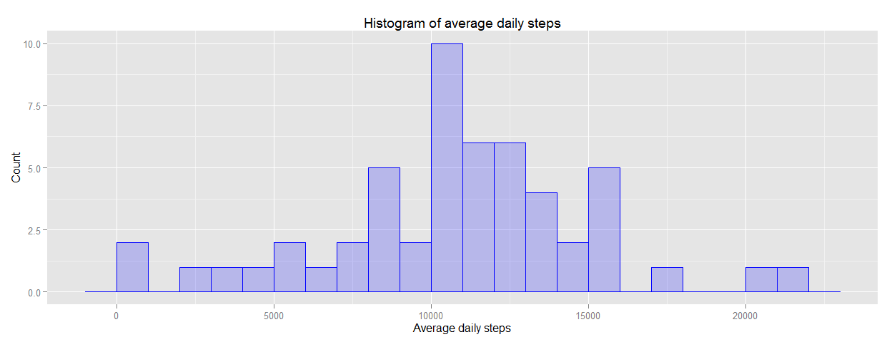
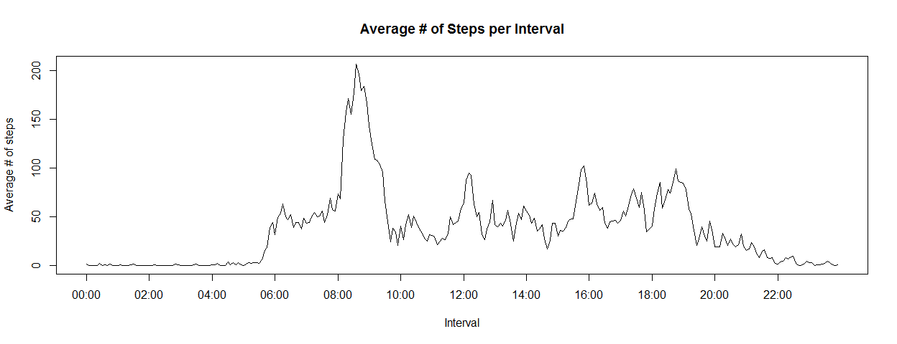
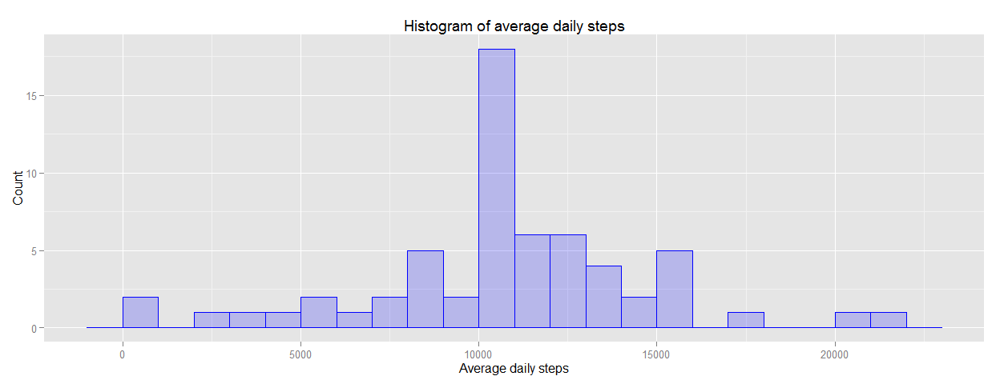
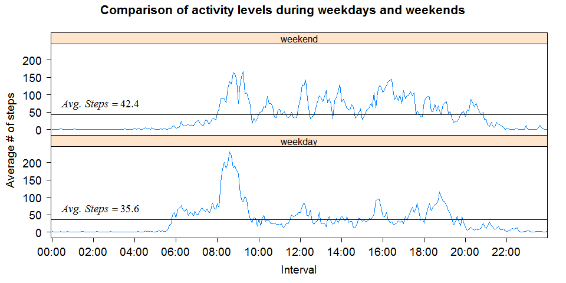

# Reproducible Research - Peer Assessment 1


# Preliminaries  #
## Load relevant libraries ##

```r
require(ggplot2)
require(lattice)
require(latticeExtra)   # to be able to use ablineq, labeling a line in lattice
require(stringr)        # for function str_pad
require(markdown)
require(knitr)
```

## Set common parameters  ##

```r
opts_chunk$set(echo=TRUE,fig.width=13) 
```

# Assignment #
## Loading and preprocessing the data ##

Show any code that is needed to

1. Load the data (i.e. read.csv())

```r
unzip("activity.zip")
data<-read.csv("activity.csv")
```

2. Process/transform the data (if necessary) into a format suitable for your analysis 

```r
# convert to date
data$date<-as.Date(data$date,"%Y-%m-%d") 
# Reformat interval to display as time period instead of as integer number
# Rather than using time functions, I chose to simply fix the way the element is printed
# because we will not use the time properties of the interval in calculations.
# for the hour, take left most digits if strings are 3 or 4 chars long, pad with zeros to get 2 char strings.
hour<-with(data,str_pad(substr(interval,1,nchar(interval)-2),2,pad = "0"))
# for the minutes, take the 2 most right chars, pad with leading zero if necessary to get 2 char strings
min<-with(data,str_pad(substr(interval,nchar(interval)-1,nchar(interval)),2,pad = "0"))
data$interval<-with(data,paste0(hour,":",min))
data$interval<-as.factor(data$interval)               
# create dataset datarmNA for easy of use for questions where we need to ignore missing data
datarmNA<-data[complete.cases(data),]   
```

## What is mean total number of steps taken per day? ##


Calculate the total number of steps taken per day. 
Make a histogram of the total number of steps taken each day.


```r
TotalStepsPerDay<-tapply(datarmNA$steps,datarmNA$date,sum)
qplot(TotalStepsPerDay,geom="histogram",binwidth = 1000,main = "Histogram of average daily steps", 
      xlab = "Average daily steps", ylab="Count", fill=I("blue"), col=I("blue"), alpha=I(.2))
```

 

Calculate and report the mean and median of the total number of steps taken per day

```r
MeanSteps<-mean(TotalStepsPerDay)
MedianSteps<-median(TotalStepsPerDay)
```

*Mean number of steps is* **10766** *and 
Median number of steps is* **10765** *.*

## What is the average daily activity pattern? ##

Make a time series plot (i.e. type = "l") of the 5-minute interval (x-axis) and the average number of steps taken, averaged across all days (y-axis)


```r
StepsPerInterval<-tapply(datarmNA$steps,datarmNA$interval,mean)
plot(StepsPerInterval, type="l",xaxt="n",xlab="Interval",ylab="Average # of steps",main="Average # of Steps per Interval")
# Plot x-axis separately, to be able to precisely control labels printed
axis(1, at=1:12*24-23,labels=names(StepsPerInterval[1:12*24-23]))
```

 

Which 5-minute interval, on average across all the days in the dataset, contains the maximum number of steps?

```r
maxInterval<-names(which.max(StepsPerInterval))
```

*The 5-minute interval with the maximum number of steps statrts at* **08:35**.

## Imputing missing values ##

Calculate and report the total number of missing values in the dataset (i.e. the total number of rows with NAs)

```r
incompleteRows=sum(!complete.cases(data))
```

*The total number of rows with missing values is* **2304**.

Create a new dataset that is equal to the original dataset but with the missing data filled in.

*As strategy to inpute the NAs, We will fill the missing values with the average number of steps taken in the same interval in the dates for which there were data. Note that this average number of steps has been computed in the vector StepsPerInterval .*

```r
dataImputed<-data
dataImputed$steps<-
    ifelse(is.na(dataImputed$steps),StepsPerInterval[dataImputed$interval],dataImputed$steps)
```


Make a histogram of the total number of steps taken each day 


```r
TotalStepsPerDayImputed<-tapply(dataImputed$steps,dataImputed$date,sum)
qplot(TotalStepsPerDayImputed,geom="histogram",binwidth = 1000,main = "Histogram of average daily steps", xlab = "Average daily steps", ylab="Count",fill=I("blue"), col=I("blue"), alpha=I(.2))
```

 

Calculate and report the mean and median total number of steps taken per day. Do these values differ from the estimates from the first part of the assignment? What is the impact of imputing missing data on the estimates of the total daily number of steps?


```r
MeanStepsNAsImputed<-mean(TotalStepsPerDayImputed)
DiffMean<-(MeanStepsNAsImputed-MeanSteps)/MeanSteps

MedianStepsNAsImputed<-median(TotalStepsPerDayImputed)
DiffMedian<-(MedianStepsNAsImputed-MedianSteps)/MedianSteps
```

*The Mean # of Steps with imputed values is* **10766**. *Ignoring the NA values we had a mean of* **10766** *, so the difference is* **0%.**

*The Median # of Steps with imputed values is* **10766**. *Ignoring the NA values we had a median of* **10765** *, so the difference is* **0.01%.**

*Upon closer inspection of the data, the missing data are always missing for full days. Given that we replace the missing number of steps with the average number of steps, it is logical that average per day does not change. However, since all the missing dates are replaced by the average profile, there are now more days where we report as steps taken this average number (notice that in the histogram, there is a spike at the day corresponding to the average number of steps) This ever so slightly influences the median.*

## Are there differences in activity patterns between weekdays and weekends? ##

Create a new factor variable in the dataset with two levels - weekday and weekend indicating whether a given date is a weekday or weekend day. Make a panel plot containing a time series plot (i.e. type = "l") of the 5-minute interval (x-axis) and the average number of steps taken, averaged across all weekday days or weekend days (y-axis). 


```r
# Create factor for weekend/weekday
dataImputed$DayType<-ifelse(weekdays(dataImputed$date,abbreviate=TRUE) %in% c("Sun","Sat"),"weekend","weekday")
dataImputed$DayType<-as.factor(dataImputed$DayType)
# calculate average
StepsPerIntervalDayType<-with(dataImputed,aggregate(list(steps=steps),list(interval=interval,DayType=DayType),mean))
# plot
xyplot(steps~interval|DayType,
       data=StepsPerIntervalDayType,
       xlab=list("Interval",cex=1.2),
       ylab=list("Average # of steps",cex=1.2),
       main=list("Comparison of activity levels during weekdays and weekends",cex=1.3),
       layout=c(1,2),
       scales=list(x=list(
           at=1:12*24-23,
           labels=names(StepsPerInterval[1:12*24-23]),
           alternating=FALSE,tck=c(1,0),cex=1.2),
           y=list(alternating=FALSE,tck=c(1,0),cex=1.2)),
       panel=function(x,y,...){
           panel.xyplot(x, y,type=c("l"))
           panel.ablineq(h=mean(y),pos=3,at=0.1,digits=1,cex=1.2,varNames=alist(y="Avg. Steps"))    
       })
```

 
*The following differences can be observed:*

- *The average # of steps is higher in weekend vs. weekdays.*
- *The morning activity starts earlier during weekdays.*
- *The activity has a higher peak around noon and late afternoon during weekends.*
